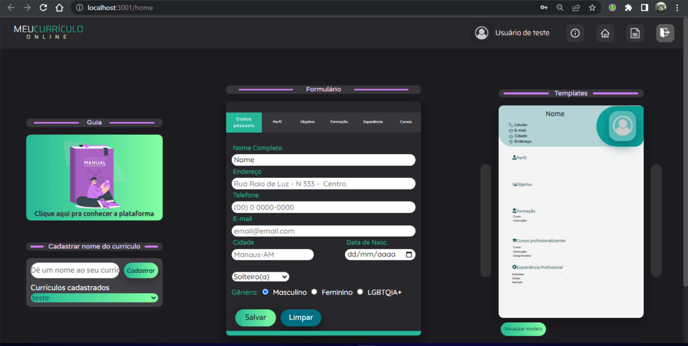
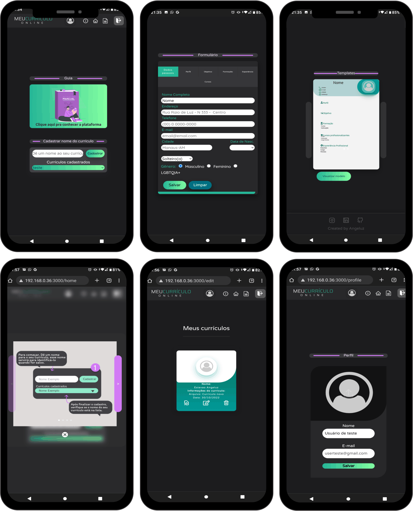

<h1 align="center"> Meu Currículo Online </h1>  

    
  </a>

  Projeto Feito para paresentação da primeira feira de tecnologia e inovação - UNINORTE.

## Table of Contents

- [Introdução](#introdução)
- [Recursos](#Recursos)
- [Contribuidores](#Desenvolvedor)
- [Processo para Buildar](#build-process)

## Introdução

O projeto foi desenvolvido com o intuito de propor ao usuário uma forma simples e intuitiva a maneira de como criar o seu currículo. Pensando nisso 
o site foi estruturado em uma linha de raciocino linear, onde cada elemento fica ao lado do outro, indicando que o passo a passo será em sequência, no site o usuário poderá criar uma conta e ao acessar a plataforma o mesmo será apresentado a tela inicial(home), onde poderá realizar o processo de desenvolvimento do currículo, a plataforma disponibiliza somente dois templates para testes, após realizar o processo de inserir seus dados no formulário do currículo o usuário deve salvar as informações fornecidas para assim ter um controle dos seus dados, podendo altera-los, exclui-los e visualiza-los. a plataforma também conta com uma aba para o usuário que contém as funcionalidades de alterar o nome e adicionar uma foto.

**Aplicação web**

  

    
  </a>
    

    
  </a>

## Recursos do Projeto

Funcionalidades disponíveis no site Meu Currículo Online:

* Criar uma conta.
* Criar o seu currículo de uma maneira simplifica, intuitiva e com resultados visuais muito mais agradáveis do que a maneira convencional de fazer.
* Ogarnização dos seus curriculos com a possibilidade de Editar, Excluir e Visualizar.
* Editar o seu Perfil como o nome e foto.
